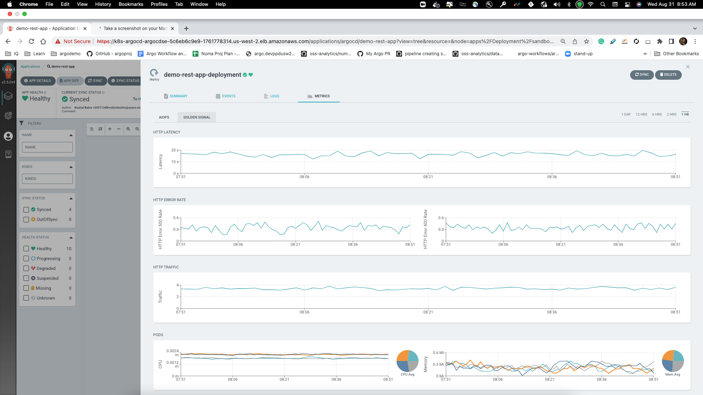

# ArgoCD Extension Metrics

The project introduces the ArgoCD extension to enable Metrics on Resource tab.


# Quick Start

- Install Argo CD and Argo CD Extensions Controller: https://github.com/argoproj-labs/argocd-extensions
- Create `argocd-metrics-server` deployment in `argocd` namespace

```sh
kubectl apply -n argocd \
    -f https://raw.githubusercontent.com/argoproj-labs/argocd-extension-metrics/main/manifests/install.yaml

kubectl apply -n argocd https://raw.githubusercontent.com/argoproj-labs/argocd-extension-metrics/main/manifests/configmap.yaml

```

- Create `argocd-extension-metrics` extension in `argocd` namespace

```
kubectl apply -n argocd \
    -f https://raw.githubusercontent.com/argoproj-labs/argocd-extension-metrics/main/manifests/extension.yaml
```

# Enable the Argo UI to access the ArgoCD Metrics Server.

## ArgoCD < v2.7

ArgoCD version less than v2.7 doesn't support the `Backend Proxy`. You have to configure the Ingress to deviate the API calls between ArgoCD server and ArgoCD metrics Server

```yaml
spec:
  rules:
    - http:
        paths:
          - backend:
              service:
                name: argocd-o11y-server
                port:
                  number: 9003
            path: /extensions/metrics
            pathType: Prefix
          - backend:
              service:
                name: argocd-server
                port:
                  number: 80
            path: /
            pathType: Prefix
```

## ArgoCD >= v2.7

ArgoCD Team is working to implemented backend proxy [proposal](https://github.com/argoproj/argo-cd/blob/master/docs/proposals/proxy-extensions.md)
